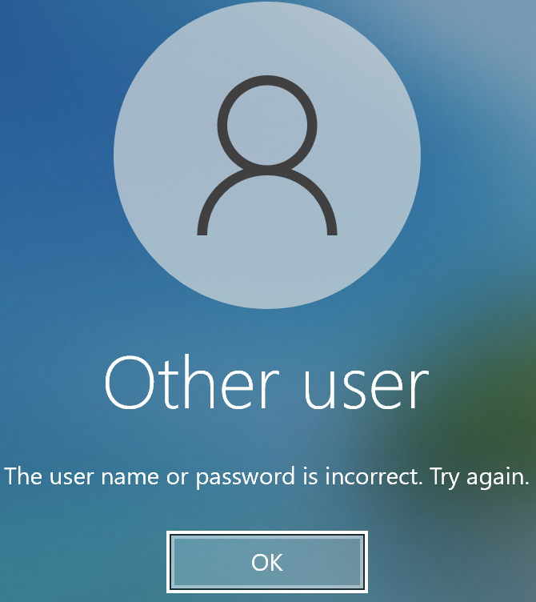
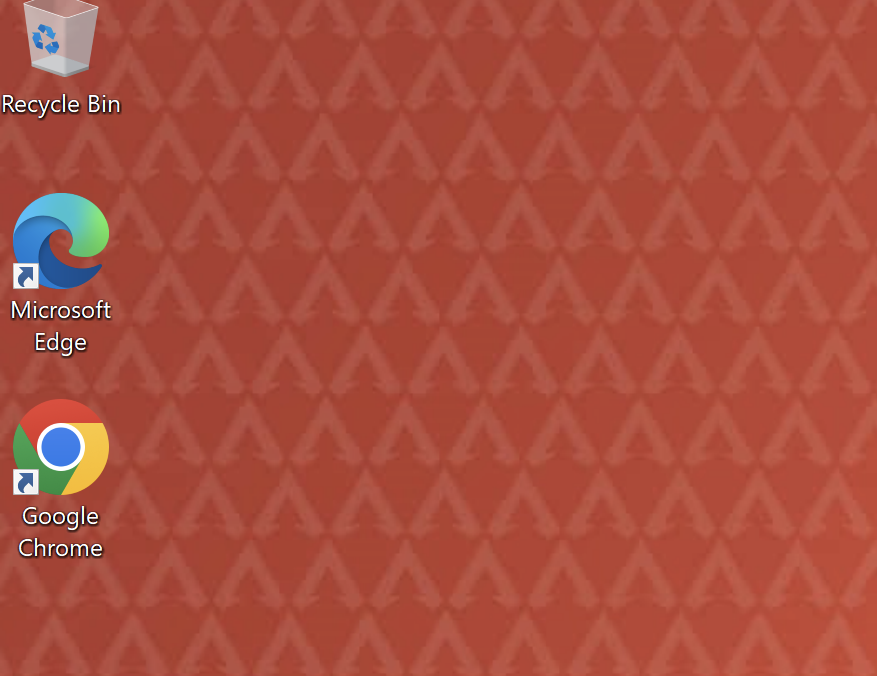
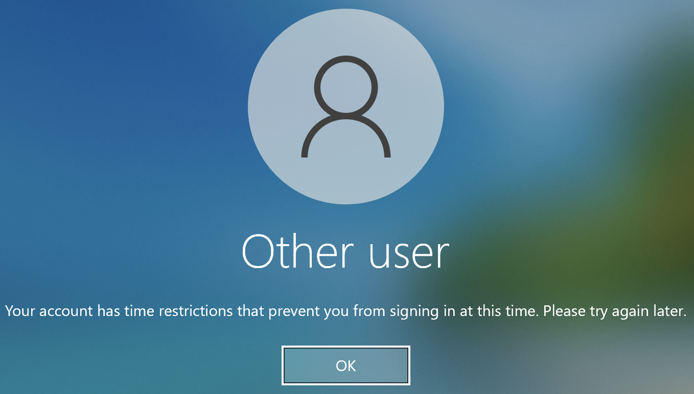

Prepared by MUGISHA Loic

# Active Directory Homelab – Windows Server 2025

## Project Overview

This is a hands-on homelab project where I set up a secure and functional Active Directory (AD) environment using **Windows Server 2025** as the Domain Controller and two Windows 10 clients. The goal was to simulate a real-world IT infrastructure that includes proper Group Policy configurations, user access control, software deployment, and delegation practices. I also got to troubleshoot common AD issues along the way.

---

## Homelab Infrastructure

| Component | Details |
| --- | --- |
| Domain Name | `Apex-Corp.com` |
| Domain Controller | Windows Server 2025 |
| Client Systems | Windows 10 (joined to the domain) |
| Hypervisor | VMware Fusion |
| Network Services | DHCP, DNS |

---

## Key Implementations

### Group Policy Configuration (GPO)

- Set up strong password policies (complexity, age, length).
- Configured **account lockout threshold** to protect against brute force attacks. 
- Enforced auto screen lock and idle time limits.
- Blocked access to the Control Panel and USBs for standard users.

### Customization via GPO

- Deployed a custom desktop wallpaper to all domain users. 
- Pushed out **Google Chrome** silently to domain clients via GPO. 

### Organizational Unit (OU) Structure

Created three OUs to organize users and apply policies cleanly:
- `Management`
- `Staff`
- `IT Support`

Applied GPOs at the OU level to ensure specific policy application.

### Role-Based Access & Shared Folders

- Created shared folders with NTFS permissions to control access:
    - Management-only access
    - Read/Write for Staff
    - Full control for IT Support
- Used ACLs to fine-tune access and blocked inheritance where needed.

### Logon Hours

- Configured logon hours for Staff users to restrict access to weekdays only, and the organization's working hours (9-5 pm). 
- Enforced auto-logoff for idle remote desktop sessions.

### Delegation of Control

- Delegated control of the other OU to an `IT Support` user with specific permissions:
    - Reset passwords
    - Unlock user accounts
    - Create/delete user objects
    - Add or remove from a group
- Used the Delegation Wizard and followed least privilege principles.

### DHCP and Network Setup

- Set up DHCP with:
    - IP scopes and reservations
    - DNS and gateway options
    - Dynamic DNS updates

---

## Troubleshooting Practice

During the setup, I encountered and resolved a few common real-world issues:

- A client machine failed to join the domain because the **default gateway was incorrectly configured**. After correcting the network settings, the client joined successfully.
- One user couldn’t log in even with the right credentials. I **reset the password** and made sure their account wasn’t locked out or disabled.
- Had to ensure that DNS resolution was working correctly for domain joins — adjusted the client to point to the Domain Controller’s IP as its DNS.

These issues gave me good hands-on experience in diagnosing and resolving Active Directory and network-related problems.

---

## Skills Demonstrated

- Active Directory Domain Services (AD DS)
- Group Policy Management (GPMC)
- Role-Based Access Control (RBAC)
- Organizational Unit (OU) Design
- Delegation and Least Privilege Practice
- Software Deployment via GPO
- DHCP Configuration and Reservations
- Security Hardening via GPO
- NTFS and Share Permissions Management
- Troubleshooting Domain Join and Login Issues

---

## What I Learned

This lab helped me better understand the day-to-day responsibilities of a Windows sysadmin. Working with GPOs, designing OUs, and practicing permission control gave me a lot of insight into managing users and computers in a domain environment. Troubleshooting real issues like login failures and domain join problems made it even more valuable.

---

## Future Plans

- Add WSUS for centralized Windows Update management.
- Set up NPS for RADIUS authentication.
- Try integrating a Linux client using Samba.
- Automate account creation and folder provisioning using PowerShell.

---
